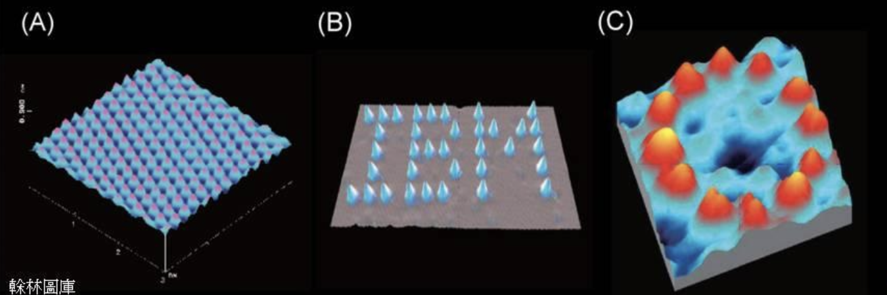

# [原子理論發展時間線 (Timeline of Atomic Theory Development)]()

## 1803年
- 道耳頓依據定比定律提出原子學說 (Dalton proposed his atomic theory based on the law of definite proportions)
  - 提出三個主要觀點:
    1. 元素是由不可分割的原子所組成 (Elements are composed of indivisible atoms)
    2. 每一種元素的原子有各自特定的質量 (Atoms of the same element have identical masses)
    3. 同種元素的原子量相同；不同元素的原子量不同 (Atoms of different elements have different masses)

## 1827年
- 英國植物學家布朗 (Robert Brown) 發現布朗運動
  - 觀察到花粉懸浮在水中時呈現不規則移動
  - 這成為原子存在的第一個有力證據
  - 布朗運動：懸浮於液體的小顆粒因與液體分子碰撞而產生的不規則運動

## 1905年
- 愛因斯坦 (Einstein) 提出布朗運動的理論解釋
  - 用統計數學方法處理水粒子對花粉所造成的碰撞效應
  - 計算出花粉粒子隨機運動時任兩次碰撞點間的平均距離
  - 同年也提出了「相對論」和「光電效應」理論

## 1908年
- 法國物理學家佩蘭 (Jean Perrin) 實驗證實愛因斯坦的布朗運動理論
  - 這進一步確認了原子實際存在的證據


<br><br>


# [影響布朗運動的因素 (Factors Affecting Brownian Motion)]()

## 主要影響因素

### [一、 溫度 (Temperature)]()
- **溫度越高 → 布朗運動越明顯**
  - 原理：溫度升高使液體分子運動速度加快
  - 影響：
    - 水分子運動的速度愈快
    - 撞擊微粒的作用力愈強
    - 分子的平均動能增加
  - 結果：微粒的不規則運動更為劇烈且頻繁

### [二、 微粒大小 (Particle Size)]()
- **微粒大小愈小 → 布朗運動越明顯**
  - 原理：微粒質量與表面積的比例變化
  - 影響：
    - 特定時間內與微粒相撞的分子數較少
    - 來自不同方向的撞擊力不平衡性增加
    - 較小的微粒需要較小的力就能產生明顯位移
  - 結果：運動的不規則性及幅度增加

### [三、 液體黏度 (Fluid Viscosity)]()
- **液體黏度越低 → 布朗運動越明顯**
  - 原理：低黏度液體中分子運動受阻力小
  - 影響：
    - 液體分子間的內摩擦力減少
    - 微粒在液體中移動的阻力減小
  - 結果：微粒運動更加自由，顯現更明顯的布朗運動

### [四、 介質密度 (Medium Density)]()
- **介質密度適中 → 布朗運動最明顯**
  - 原理：密度影響分子間碰撞頻率和力度
  - 影響：
    - 太稀薄：分子碰撞頻率低
    - 太密集：微粒移動空間受限
  - 結果：在適中密度下，碰撞效應最佳化

## [布朗運動的物理解釋]()

### [碰撞不平衡性 (Collision Imbalance)]()
- 微粒受到的分子撞擊在不同時刻從不同方向來臨
- 斜點部分：微粒受各方分子撞擊不平衡，合力不為零
- 直線部分：微粒受各方分子撞擊平衡，合力為零

### [統計學解釋 (Statistical Explanation)]()
- 愛因斯坦 (1905) 提出的數學模型：
  - 運用統計力學原理
  - 證明微粒位移的均方根與時間的平方根成正比
  - 推導出任兩次碰撞點間的平均距離公式


<br><br>


# [原子單位計算 (Atomic Unit Calculations)]()

## 原子大小的測量單位
- **埃 (Å)**
  - 原子大小的尺度單位配作 Å，讀作「埃」
  - 1 Å = 10⁻¹⁰ m (一百億分之一公尺)

- **奈米 (nm)**
  - 1 nm = 10⁻⁹ m (十億分之一公尺)
  - 1 Å = 10⁻¹⁰ m = 0.1 nm

## 原子尺度
- 原子尺度大約在 **0.1 nm** (或 1 Å)
- 換算關係：
  ```
  1 nm = 10⁻⁹ m
  1 Å = 10⁻¹⁰ m
  ```


<br><br>


# [各式顯微鏡與技術比較 (Comparison of Microscopes & Imaging Techniques)]()

## [各式顯微鏡比較 (Comparison of Microscopes)]()

### 顯微鏡種類與解析度
| 顯微鏡種類 | 解析度 | 備註 |
|------------|---------|------|
| 光學顯微鏡 | 數百埃 | 約可見細胞 |
| 電子顯微鏡 | 數埃 | 約可見原子 |

### 原子觀察能力
- 人們除了可以利用特殊的顯微鏡觀看原子，還可觀動它
- 顯微鏡圖像展示了(A)(B)(C)三種不同的原子觀察方式




## [各式顯影技術比較 (Comparison of Imaging Techniques)]()

### X-ray (X射線)
- **原理**：利用X射線穿透物質的特性
- **備註**：會穿透軟組織，只可觀出骨骼
- **應用**：醫學診斷，骨骼檢查

### 電腦斷層掃描 (CT, Computed Tomography)
- **原理**：利用不同角度的X-ray，建構不同方向的影像剖面
- **處理方式**：由電腦運算而成立體影像
- **優點**：可得不同方向的影像剖面，立體成像

### 磁共振 (MRI, Magnetic Resonance Imaging)
- **原理**：利用磁定軸相關磁場影響水分子有磁性的氫
- **備註**：
  - 病患：適用於軟組織成像
  - 中文叫核子共振
  - 人工心臟調節器不適用

### 掃描穿隧式顯微鏡 (STM, Scanning Tunneling Microscope)
- **原理**：利用電子之穿隧效應
- **備註**：
  - 只適用於導體
  - 可研究表面原子

### 原子力顯微鏡 (AFM, Atomic Force Microscope)
- **原理**：利用原子間之凡得瓦爾力
- **備註**：適用於各種表面
- **優點**：不限於導電材料，應用範圍更廣

## [各技術的應用比較]()

### 可觀察尺度比較
- 光學顯微鏡：微米級別，可見細胞結構
- 電子顯微鏡：奈米級別，可觀察細胞內細小結構
- STM/AFM：原子級別，可觀察表面原子排列

### 技術特性比較
- X-ray/CT/MRI：適用於醫學診斷，觀察內部結構
- STM/AFM：適用於材料科學，觀察表面原子結構


<br><br>


# [物質三態 - 從原子觀點分析]()

## [物質中原子(分子)受力概述]()

物質中的原子(分子)主要受到兩種相互對立的作用力：
- **分子間的吸引力**：企圖使粒子互相靠近
- **分子的熱運動及碰撞**：企圖使粒子互相遠離

這兩種力的平衡決定了物質的狀態，形成了固體、液體和氣體三種基本狀態。

## [一、固體 (Solid)]()

### 微觀結構特徵
1. **粒子間距**：粒子間的平均距離**較短**
2. **位置特性**：
   - 固體原子(分子)在某個固定點附近
   - 只能有**小幅度的來回振盪**
   - 粒子間的相對位置及距離不易改變
3. **穩定性**：稍微偏離平衡位置就會產生強烈的吸引力或排斥力，迅速拉回到平衡位置

### 宏觀表現
- **形狀**：固定
- **體積**：固定
- **結構**：造成有固定的形狀及體積的規則結構

### 圖示說明
固體中的粒子呈現規則排列，振動幅度小，彼此保持固定相對位置

## [二、液體 (Liquid)]()

### 形成過程
固體溫度升高，原子(分子)的振盪會變得劇烈，粒子間的平均距離逐漸增大，吸引力漸弱

### 微觀結構特徵
1. **粒子運動**：原子(分子)間的作用力大小已不足以維持粒子彼此之間的相對位置
2. **位置特性**：粒子可以相對移動，但仍然保持較近的距離
3. **穩定性**：
   - 從物體外觀的形狀無法保持固定
   - 原子(分子)粒子間的吸引力**還足以維持體積**

### 宏觀表現
- **形狀**：不固定，隨容器變化
- **體積**：固定
- **流動性**：具有流動性，可以改變形狀

### 圖示說明
液體中的粒子排列不規則，但彼此之間仍保持一定距離，有足夠的吸引力維持整體體積

## [三、氣體 (Gas)]()

### 形成過程
液體溫度升高，原子(分子)平均距離變得更大

### 微觀結構特徵
1. **粒子運動**：原子(分子)間彼此相互牽制的力量更小，甚至可以完全忽略
2. **運動特性**：粒子可以各自單獨行動
3. **相互作用**：粒子間的相互作用極弱

### 宏觀表現
- **形狀**：不固定
- **體積**：不固定，會膨脹填滿容器
- **流動性**：極高

### 圖示說明
氣體中的粒子完全自由運動，彼此之間距離很大，幾乎沒有固定結構

## 三態比較表

| 特性 | 固體 | 液體 | 氣體 |
|------|------|------|------|
| 分子間距 | 最小 | 中等 | 最大 |
| 分子運動 | 小幅振動 | 可相對滑動 | 自由運動 |
| 分子間吸引力 | 最強 | 中等 | 最弱或可忽略 |
| 形狀 | 固定 | 不固定 | 不固定 |
| 體積 | 固定 | 固定 | 不固定 |
| 可壓縮性 | 極低 | 低 | 高 |
| 流動性 | 無 | 有 | 極高 |

## 物質三態的轉換

### 固體→液體 (融化/熔化)
- 溫度升高，分子振動加劇
- 分子間吸引力不足以保持固定位置
- 保持體積但失去固定形狀

### 液體→氣體 (汽化/蒸發)
- 溫度繼續升高，分子運動更劇烈
- 分子間吸引力不足以維持固定體積
- 分子可自由運動，擴散到整個容器